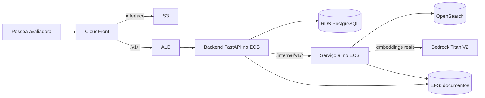

# Arquitetura observável

Este é o desenho da implantação definida em [CDK](../hackathon/infra/) e na [ADR-0002](../hackathon/docs/adr/0002-implantacao-aws-ecs-fargate-cdk.md); o diagrama não atesta que a stack esteja ativa. No [Compose local](../hackathon/docker-compose.yml), o frontend usa o proxy `/v1/*` para o backend, Postgres e OpenSearch rodam em containers, e `EMBEDDER=fake` evita chamadas ao Bedrock. O navegador não chama o serviço `ai` diretamente ([configuração do Vite](../hackathon/frontend/vite.config.ts)).

| Fronteira | Contrato e implementação |
| --- | --- |
| Frontend ↔ backend | [Contrato](../requirements/contracts/frontend-backend.md), [cliente `/v1`](../hackathon/frontend/src/api/client.ts) |
| Backend ↔ serviço vetorial | [Contrato](../requirements/contracts/backend-vector-service.md), [cliente do backend](../hackathon/backend/app/clients/ai_client.py) |
| Corpus ↔ extração | [Contrato](../requirements/contracts/extraction-route.md), [pipeline](../hackathon/tools/pipeline/README.md) |

Autenticação Cognito é um modo configurável do backend ([código](../hackathon/backend/app/auth.py)); o login da interface local é de demonstração ([código](../hackathon/frontend/src/pages/LoginPage.tsx)). As restrições de rede da AWS estão nos [stacks](../hackathon/infra/capiwatt_infra/), e as observações de segurança e suas limitações estão em [segurança](security.md).
