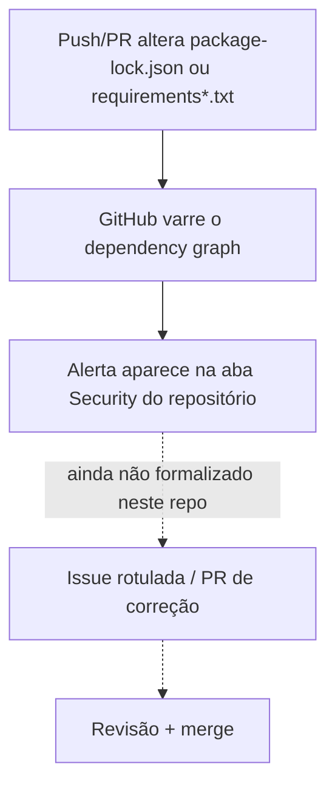

# Segurança e tratamento de vulnerabilidades

Este documento descreve os mecanismos observáveis neste repositório para detectar vulnerabilidades em dependências — não uma alegação de que o sistema é seguro ou livre de vulnerabilidades.

## Detecção: Dependabot alerts nativos do GitHub

Não há um `.github/dependabot.yml` neste repositório — ou seja, não há um cronograma customizado de *version updates*. O que está ativo é a varredura nativa do GitHub sobre os manifestos de dependência (dependency graph + Dependabot alerts), que roda sem configuração adicional.

Em 26/09/2026, o repositório tinha **11 alertas abertos**, nenhum descartado (`dismissed`) e nenhum marcado como corrigido (`fixed_at`):

| Ecossistema | Manifesto | Pacote | Severidade |
|---|---|---|---|
| pip | `hackathon/ai/requirements-dev.txt` | pytest | medium |
| pip | `hackathon/backend/requirements-dev.txt` | pytest | medium |
| npm | `hackathon/frontend/package-lock.json` | esbuild (transitivo) | medium |
| npm | `hackathon/frontend/package-lock.json` | vite | medium |
| npm | `hackathon/frontend/package-lock.json` | vite | **high** |
| npm | `hackathon/frontend/package-lock.json` | vite | medium |
| npm | `hackathon/frontend/package-lock.json` | vitest | **critical** |
| npm | `hackathon/frontend/package-lock.json` | vitest | medium |
| npm | `hackathon/frontend/package-lock.json` | @vitest/mocker (transitivo) | medium |
| npm | `hackathon/frontend/package-lock.json` | react-router (transitivo) | medium |
| npm | `hackathon/frontend/package-lock.json` | react-router (transitivo) | medium |

Todos os pacotes afetados são dependências de desenvolvimento ou de build (`vite`, `vitest`, `esbuild`, `pytest`) ou de runtime do frontend (`react-router`) — não há alerta aberto tocando o `backend` ou o serviço `ai` em produção.

## Fluxo observado (estado atual, não idealizado)

As setas tracejadas marcam o que **ainda não existe** neste repositório: não há label `security`, nem issue, nem PR abertos referenciando qualquer um dos 11 alertas atuais. A detecção está ativa; a triagem desses alertas em trabalho rastreável (issue, responsável, prazo) ainda não foi formalizada como prática recorrente.

## Outras ferramentas disponíveis, ainda não aplicadas com evidência no histórico

O time de agentes tem acesso a uma skill de `security-review` ("Complete a security review of the pending changes on the current branch"), pensada para revisar o diff de uma branch antes do merge. Não há, até o momento, PR ou issue neste repositório citando seu uso — é uma prática disponível, não uma prática já estabelecida.

## Como isso deveria evoluir

Dado o volume atual (11 alertas, incluindo um `critical` e um `high` em dependências de dev/build do frontend), o próximo passo natural é decidir uma política mínima: um label para rastrear alertas de dependência convertidos em issue, e um critério de quando isso é obrigatório (ex.: severidade `high`/`critical`) versus aceitável para o ciclo do hackathon. Este documento registra o estado observado; a política em si ainda não foi decidida pelo time.
